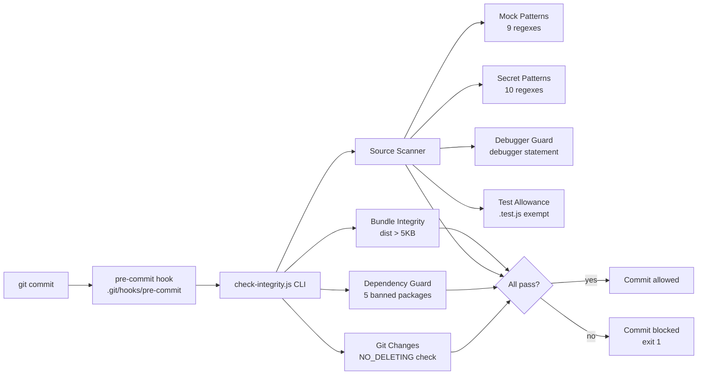

# AI Agent Guardian

**A personal pre-commit hook for developers pairing with AI coding agents (Cursor, Claude Code). Scans for mock data, leaked secrets, and forgotten `debugger` statements, and blocks accidental deletion of critical directories before a commit lands.**

[](https://opensource.org/licenses/MIT)
[](https://nodejs.org/)
[](https://eslint.org/)
[](https://jestjs.io/)
[](https://vitejs.dev/)
[]()

---

## Honest Disclosure — Read First

This repository is **not a production-grade secret scanner** like [Gitleaks](https://github.com/gitleaks/gitleaks) or [TruffleHog](https://github.com/trufflesecurity/trufflehog). Its scope is intentionally narrow: a personal safety net for a single developer working with AI coding agents.

### What this repo does

- Installs a native `pre-commit` hook that blocks commits when AI agents attempt to delete `src/`, `config/`, `public/`, `assets/`, `.agents/`, or `scripts/` directories.
- Scans `src/` for 9 mock-data patterns (`mockData`, `dummyData`, `fakeData`, and similar identifiers) before allowing a commit.
- Scans source files for 10 common secret formats via regex (GitHub PAT, OpenAI `sk-`, AWS `AKIA`, Stripe `sk_live_`, Google `AIza...`, Slack `xox`, and 4 others).
- Blocks 5 deprecated npm packages from being added to `package.json` (`request`, `node-sass`, `express-jwt`, `moment`, `axios-mock-adapter`).
- Detects forgotten `debugger;` statements in production source files.
- Verifies that the `dist/` directory is larger than 5 KB after a build (catches empty-bundle failures).
- Provides a `network-monitor.js` script that tests connection latency to Gemini, Claude, and OpenAI APIs.

### What this repo does not do

- **No Git history scanning.** Only the working tree and staged changes are scanned. Leaked secrets in past commits are not detected. Use Gitleaks for this.
- **No entropy-based secret detection.** Only 10 hardcoded regex patterns are used. Custom or unconventional secret formats will be missed. Use TruffleHog for entropy-based detection.
- **No binary file scanning, no `.env` file scanning, no commit message scanning.**
- **No CVE database and no license compliance check.** Only 5 specific deprecated packages are blocked.
- **No active secret verification.** TruffleHog verifies whether a leaked secret is still active by making a test API call; this repo does not.

### When to use this repo vs alternatives

| Use case                                              | Recommended tool                                                                                             |
| ----------------------------------------------------- | ------------------------------------------------------------------------------------------------------------ |
| Personal pre-commit safety net for AI-agent workflows | This repo                                                                                                    |
| Production secret scanning across an organization     | [Gitleaks](https://github.com/gitleaks/gitleaks) (200+ patterns, scans Git history, GitHub Action available) |
| Verifying whether leaked secrets are still active     | [TruffleHog](https://github.com/trufflesecurity/trufflehog) (800+ detectors with active verification)        |
| Blocking secrets before they reach GitHub             | GitHub Push Protection (built into GitHub Advanced Security)                                                 |

---

## Architecture



## Features

- **Native Git hook installer** — Writes a `pre-commit` hook to `.git/hooks/` via `fs.chmodSync(path, '755')`. No Husky dependency.
- **Working-tree scanner** — Recursively walks `src/`, applies regex patterns, and exits with code 1 on violations.
- **Programmatic API** — `require('ai-agent-guardian')` exposes `getVersion()`, `listPatterns()`, `scanString()`, `scanFile()`, and `runIntegrityCheck()` for use as a library.

---

## Tech Stack

| Category   | Technology                        |
| ---------- | --------------------------------- |
| Runtime    | Node.js 18+                       |
| Testing    | Jest 29 (27 tests, 100% coverage) |
| Linting    | ESLint 8+                         |
| Packaging  | Vite 5+                           |
| Formatting | Prettier 3                        |
| CI/CD      | GitHub Actions                    |

---

## Quick Start

### Prerequisites

- Node.js 18+ and npm 9+

### Installation

```bash
git clone https://github.com/ntd25022006q/ai-agent-guardian.git
cd ai-agent-guardian

npm install

# Install the native pre-commit hook into .git/hooks/
node scripts/install-hooks.js
```

### Available Scripts

| Script             | Description                                                                                           |
| ------------------ | ----------------------------------------------------------------------------------------------------- |
| `npm test`         | Runs Jest unit tests (27 tests, 100% coverage)                                                        |
| `npm run lint`     | Runs ESLint                                                                                           |
| `npm run format`   | Formats code with Prettier                                                                            |
| `npm run guardian` | Manually runs the integrity scanner (Git changes + mock/secret/debug + build size + dependency guard) |
| `npm run monitor`  | Tests connection latency to OpenAI, Gemini, and Claude APIs                                           |

### Programmatic API

```js
const guardian = require("ai-agent-guardian");

guardian.getVersion();
// => '1.0.0'

guardian.listPatterns();
// => { protectedDirs: [...], mockPatterns: [...], secretPatterns: [...], bannedPackages: [...] }

guardian.scanString("const mockUsers = [];");
// => { mock: [{ line: 1, content: 'const mockUsers = [];' }], secret: [], debug: [] }

guardian.scanFile("./src/app.js");
// => { mock: [], secret: [], debug: [] } | null (if file is not source code)

guardian.runIntegrityCheck({ src: "src", dist: "dist" });
// => Runs the Git + Dependency + Source + Build pipeline
```

---

## Quality Gates

Each gate must pass, or the pre-commit hook blocks the commit.

| Gate | Rule name          | Enforces                                                                       |
| ---- | ------------------ | ------------------------------------------------------------------------------ |
| 1    | `NO_DELETING`      | Blocks deletion of `src`, `config`, `.agents`, and other protected directories |
| 2    | `ZERO_MOCK_DATA`   | Blocks mock-data structures in production source files                         |
| 3    | `TEST_ALLOWANCE`   | Allows `.test.js` files to declare mocks freely                                |
| 4    | `BUNDLE_INTEGRITY` | Blocks builds smaller than 5 KB (catches empty bundles)                        |
| 5    | `CLEAN_SYNTAX`     | ESLint with zero errors/warnings configuration                                 |
| 6    | `REGRESSION_TEST`  | Runs the test suite before allowing a commit                                   |
| 7    | `SECRET_SCANNER`   | 10 regex patterns for common API key formats                                   |
| 8    | `DEBUGGER_GUARD`   | Detects `debugger;` statements in production code                              |
| 9    | `DEPENDENCY_GUARD` | Blocks 5 deprecated npm packages                                               |

---

## Project Structure

```
ai-agent-guardian/
├── src/
│   └── index.js                # Public API: getVersion, listPatterns, scanString, scanFile, runIntegrityCheck
├── scripts/
│   ├── check-integrity.js      # CLI: Git changes + mock/secret/debug scanner + build size + dep guard
│   ├── install-hooks.js        # Native pre-commit hook installer
│   ├── network-monitor.js      # API latency test (Gemini, Claude, OpenAI)
│   ├── test-guardian.js        # 8-scenario integration test
│   ├── gitleaks-benchmark.js   # Comparison benchmark against Gitleaks fixtures
│   ├── stress-test.js          # Performance test on 10K files
│   └── stress-test-billion.js  # Performance test on 1M files
├── tests/
│   ├── integrity.test.js       # Jest regex validation (8 tests)
│   └── index.test.js           # Public API tests (19 tests)
├── eslint.config.js
├── jest.config.js
├── mcp-config.json             # Model Context Protocol tools template
├── package.json
└── vite.config.js
```

---

## Testing

```bash
npm test
```

The test suite includes:

- 8 tests validating the 10 secret-detection regex patterns against the Gitleaks benchmark fixtures
- 19 tests covering the public API (`getVersion`, `listPatterns`, `scanString`, `scanFile`, `runIntegrityCheck`)
- 100% statement, branch, function, and line coverage

---

## License

MIT License — see [LICENSE](LICENSE). Copyright (c) 2026 Nguyen Tien Dat.
